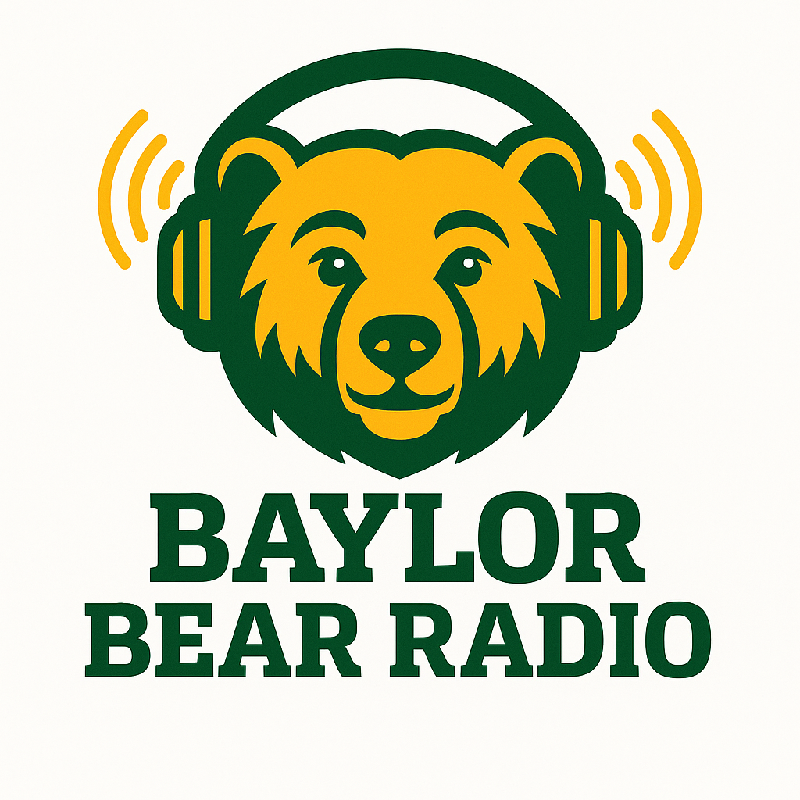

<p align="center">
	
</p>

# Baylor Bear Radio

This application streams audio over QUIC using the MoQ protocol. It mimics a radio station where clients can tune in and listen in real time. There
is a version that runs in the command line as well as an unsynchronized version that runs over the web using web sockets. It is built in rust and uses
a publisher and subscriber model with a relay server to deliver live music to all users.


---

## How to Run

### Prerequistes
- Just - https://github.com/casey/just
- Cargo and Rust are installed


### CLI:

1. navigate into the moq-rs folder 
```bash
cd moq-rs
```
2. Start the relay server
```bash
just relay
```

3. Go back into the project directory
```bash
cd ..
```

4. Run a publisher for each channel (1-3)
```bash
cargo run --bin final-project-group3_s25 -- --station-index <channel_number> publish
```

5. Start the CLI to connect to channels
```bash
cargo run --bin cli
```

### Web Server:

1. navigate into the moq-rs folder 
```bash
cd moq-rs
```
2. Start the relay server
```bash
just relay
```

3. Go back into the project directory
```bash
cd ..
```

4. Run a publisher for each channel (1-3)
```bash
cargo run --bin final-project-group3_s25 -- --station-index <channel_number> publish
```

5. Run a subscriber for each channel (1-3)
```bash
cargo run --bin web_imp -- --station-index <channel_number> subscribe
```

6. navigate to http://localhost:3030

---
## Next Steps

- Fix the current implementation of publishing and subscribing to use a single track per station
- Find a way to synschronize the command line audio across the local time servers
- Synchronize the web server version
- Fix bugs within synchronization and web server UI


---


